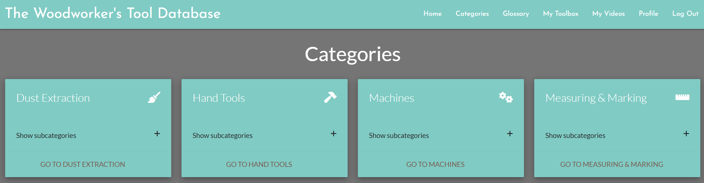
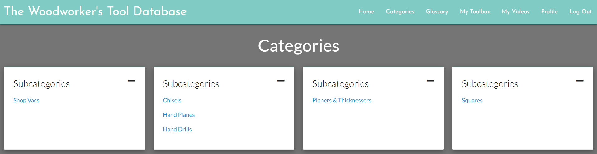

### The Woodworker's Tool Database is an incredible new resource for woodworkers featuring a comprehensive tool glossary the ability for registered users to save their favourite tools and videos!

Visit the deployed site [here](https://#)

- - -

## CONTENTS

* [Rationale](#rationale)
  * [Project Introduction](#project-introduction)
  * [Motivation and Inspiration](#motivation-and-inspiration)
  * [Background Information](#background-information)
  * [Project Scope and Limitations](#project-scope-and-limitations)
  * [Problem Statement](#problem-statement)
  * [Proposed Solution](#proposed-solution)
  * [Benefits and Advantages](#benefits-and-advantages)
  * [Future Versions](#future-versions)
  * [Summary](#summary)

* [User Stories](#user-stories)

* [Design](#design)
  * [Colour Scheme](#colour-scheme)
  * [Typography](#typography)
  * [Wireframes](#wireframes)
    * [Desktop](#desktop)
    * [Tablet](#tablet)
    * [Mobile](#mobile)

* [Database Schema](#database-schema)
  * [ERD Diagram](#erd-diagram)
  * [Models](#models)
    * [MainCategory](#maincategory)
    * [SubCategory](#subcategory)
    * [Tool](#tool)
    * [MyToolbox](#mytoolbox)
    * [MyVideos](#myvideos)

* [Features](#features)
  * [Favicon](#favicon)
  * [Non Registered Users](#non-registered-users)
    * [Navbar](#navbar)
    * [Home Page](#home-page)
    * [Categories](#categories)
    * [Tools](#tools)
    * [Glossary](#glossary) 
  * [Registered Users](#registered-users)
    * [My Toolbox](#my-toolbox)
    * [My Videos](#my-videos)
    * [Profile](#profile)
      * [Edit Profile](#edit-profile)
      * [Delete Profile](#delete-profile)
  * [Admin User](#admin-user)
    * [Admin Navbar](#admin-navbar)
    * [Admin Categories](#admin-categories)
    * [Add Main Category](#add-main-category)
    * [Edit Main Category](#edit-main-category)
    * [Delete Main Category](#delete-main-category)
    * [Add Sub Category](#add-sub-category)
    * [Edit Sub Category](#edit-sub-category)
    * [Delete Sub Category](#delete-sub-category)
    * [Add Tool](#add-tool)
    * [Edit Tool](#edit-tool)
    * [Delete Tool](#delete-tool)

* [Accessibility](#accessibility)

* [Technologies](#technologies)
  * [Languages](#languages)
  * [Frameworks, Libraries and Programs](#frameworks-libraries-and-programs)

* [Deployment and Development](#deployment-and-development)
  * [Deployment](#deployment)
  * [Local Development](#local-development)
    * [Extensions required](#extensions-required)
    * [How to Fork](#how-to-fork)
    * [How to Clone](#how-to-clone)

* [Testing](#testing)
  * [Manual Testing](#manual-testing)
  * [Automated Testing](#automated-testing)
    * [W3C](#W3C)
    * [Lighthouse](#Lighthouse)
    * [JS-Hint](#js-hint)
  * [Bugs](#Bugs)
  
* [Credits](#credits)

# Features

## Favicon

## Non Registered Users

### Navbar

When a visitor to the site first lands on the page, the only four items in the navbar are: 

* Home
* Categories
* Glossary
* Log In

### Home Page

The Home Page for non-registered users shows 4 random tool cards that change after a set period of time. 

By expanding the card, the non-registered user can see the tool description.

By clicking on the video, they can watch the video.

And by clicking on the tool name link, they are redirected to that tool's page which contains the name, description, product_links and videos for that tool.

### Categories

The category view for non-registered users is the same as it is for registered users in that the card shows all main categories and when expanded, it shows the subcategories for that main category. 

From here, users can navigate to the main category page or each individual subcategory page.

# Admin User

## Admin Navbar

The navbar for the admin user allows for easy adding of categories and tools. N.B. This functionality can be found in various places for the admin user but it seemed logical to include a direct route to these functions from the navbar.

## Admin Categories

The category view for the admin user is similar to the view for non-admin users but also incorporates the functionality to edit and delete the main category.

There is also an additional card that shows after all category cards that will redirect to the add main category page when clicked (it is quite obvious as it is a smaller car with a folder-plus icon):

When expanded, the admin user has the ability to edit and delete subcategories associated with that main category:

### Add Main Category

Adding a main category is pretty straightforward and only requires the user to type a category name. 

No other functionality or input fields were required as subcategories can be moved to different main categories when editing subcategories so this page is kept very simple indeed.

### Add Subcategory

Adding a subcategory is also straightforward; the user is given two input fields to complete, 1 for the subcategory name and a dropdown to select a main category. 

