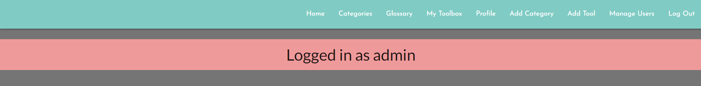
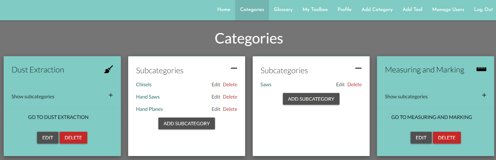
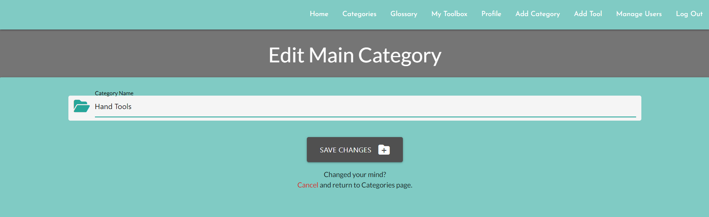
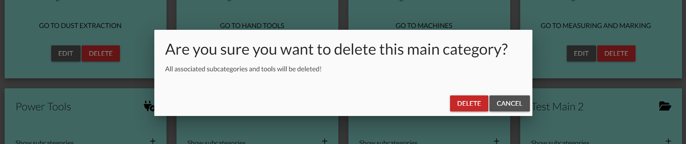
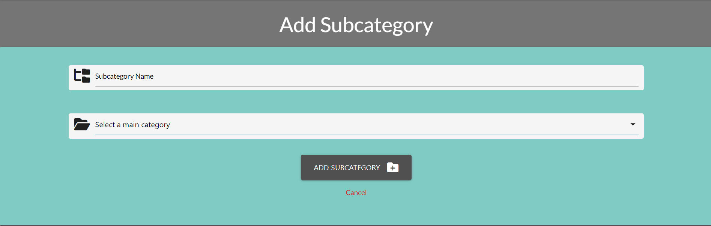
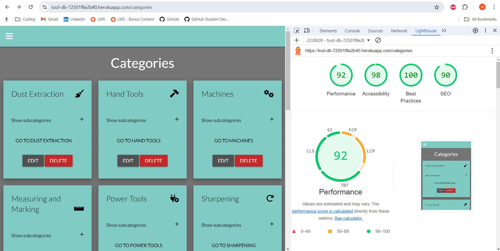
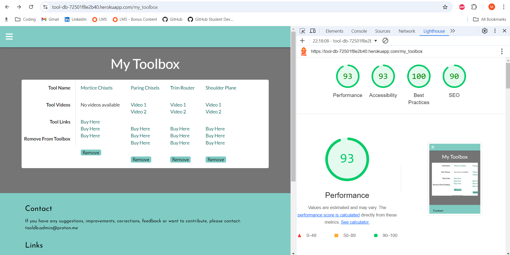
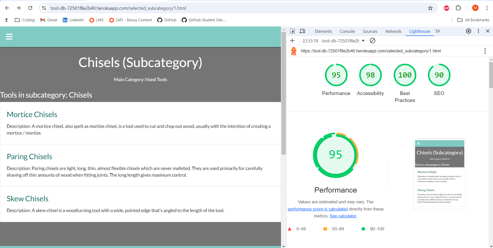

### The Woodworker's Tool Database is an incredible new resource for woodworkers featuring a comprehensive tool glossary the ability for registered users to save their favourite tools and videos!

Visit the deployed site [here](https://tool-db-72501f8e2b40.herokuapp.com/)

- - -

## CONTENTS

* [Rationale](#rationale)
  * [Project Introduction](#project-introduction)
  * [Motivation and Inspiration](#motivation-and-inspiration)
  * [Background Information](#background-information)
  * [Project Scope and Limitations](#project-scope-and-limitations)
    * [Scope](#scope)
    * [Limitations](#limitations)
  * [Problem Statement](#problem-statement)
  * [Proposed Solution](#proposed-solution)
  * [Benefits and Advantages](#benefits-and-advantages)
  * [Future Versions](#future-versions)
  * [Summary](#summary)

* [User Stories](#user-stories)

* [Design](#design)
  * [Colour Scheme](#colour-scheme)
  * [Typography](#typography)
  * [Wireframes](#wireframes)
    * [Desktop](#desktop)
    * [Tablet](#tablet)
    * [Mobile](#mobile)

* [Database Schema](#database-schema)
  * [ERD Diagram](#erd-diagram)
  * [Models](#models)
    * [MainCategory](#maincategory)
    * [SubCategory](#subcategory)
    * [Tool](#tool)
    * [MyToolbox](#mytoolbox)

* [Features](#features)
  * [Favicon](#favicon)
  * [Non Registered Users](#non-registered-users)
    * [Navbar](#navbar)
    * [Home Page](#home-page)
    * [Categories](#categories)
    * [Tools](#tools)
    * [Glossary](#glossary) 
  * [Registered Users](#registered-users)
    * [My Toolbox](#my-toolbox)
    * [Profile](#profile)
      * [Edit Profile](#edit-profile)
      * [Delete Profile](#delete-profile)
  * [Admin User](#admin-user)
    * [Admin Navbar](#admin-navbar)
    * [Admin Categories](#admin-categories)
    * [Add Main Category](#add-main-category)
    * [Edit Main Category](#edit-main-category)
    * [Delete Main Category](#delete-main-category)
    * [Add Sub Category](#add-sub-category)
    * [Edit Sub Category](#edit-sub-category)
    * [Delete Sub Category](#delete-sub-category)
    * [Add Tool](#add-tool)
    * [Edit Tool](#edit-tool)
    * [Delete Tool](#delete-tool)

* [Accessibility](#accessibility)

* [Technologies](#technologies)
  * [Languages](#languages)
  * [Frameworks, Libraries and Programs](#frameworks-libraries-and-programs)

* [Deployment and Development](#deployment-and-development)
  * [Deployment](#deployment)
  * [Local Development](#local-development)
    * [Extensions required](#extensions-required)
    * [How to Fork](#how-to-fork)
    * [How to Clone](#how-to-clone)

* [Testing](#testing)
  * [Manual Testing](#manual-testing)
  * [Automated Testing](#automated-testing)
    * [W3C](#W3C)
    * [Lighthouse](#lighthouse)
    * [JS-Hint](#js-hint)
  * [Bugs](#Bugs)
  
* [Credits](#credits)

# Rationale

## Project Introduction

The Woodworking Tool Database is a comprehensive web application designed to serve woodworking enthusiasts and hobbyists by providing a centralised platform for discovering, learning about, and purchasing woodworking tools. 

The application features an extensive tool database, product videos, product links, and user-specific tool management, creating a one-stop resource for both novice and experienced woodworkers alike.

## Motivation and Inspiration

As a passionate hobbyist woodworker, the motivation behind this project stems from a desire to streamline the process of researching and purchasing woodworking tools. Previously, finding detailed information, instructional videos, and purchasing options for tools required navigating multiple sources, which was both time-consuming and inefficient. 

The inspiration for this project was to create a single, integrated resource that simplifies and enhances the tool acquisition process, thereby saving time and improving the overall woodworking experience.

## Background Information

To build anything out of wood, from the smallest bandsaw box to a monolithic cabinet; tools are essential. However, the process of selecting and purchasing the right tool often involves extensive research across multiple platforms. Users typically need to search for tool specifications, watch instructional videos, and find reliable purchase links; all of which are scattered across different websites. This fragmentation can lead to frustration and also creates a disjointed experience for users.

## Project Scope and Limitations

### Scope:

* Tool Database: A comprehensive collection of woodworking tools, each with detailed descriptions, instructional videos, and purchase links.

* User Management: Allows users to add tools to their personal toolbox and manage their profile / log in details.

* Integration: Seamlessly integrates video content and purchase options within the tool profiles.

### Limitations:

* Tool Information: The accuracy and comprehensiveness of tool data are dependent on available sources and user contributions.

* Video and Link Sources: Limited to available resources and may not cover all tools or have the latest product links.

* User Authentication: Currently supports basic authentication and may not include advanced user management features.

* Search functionality: Currently there is no way for a site user to search for tools. 

### Problem Statement

Woodworking enthusiasts face challenges in efficiently finding comprehensive information about tools, including their usage, instructional content, and purchase options. The existing fragmented resources often require users to navigate multiple websites, leading to a cumbersome and time-consuming experience. There is a need for a centralised platform that integrates tool information, instructional videos, and purchase links into a single, accessible resource.

## Proposed Solution

The Woodworking Tool Database addresses these challenges by providing an integrated web application where users can:

* Access detailed information about a wide range of woodworking tools.

* Watch instructional videos directly linked to each tool.

* Find and compare purchase options from various online retailers.

* Manage personal tool collections through a user-friendly interface.

* By consolidating these resources into one platform, the project enhances the user experience, simplifies the tool research process, and supports informed decision-making.

## Benefits and Advantages

* Centralized Resource: Combines tool information, videos, and purchase links into a single platform, saving time and effort.

* Enhanced Learning: Provides educational videos for each tool, helping users understand and utilize them more effectively.

* Convenience: Offers direct purchase links, allowing users to easily compare options and make purchases without navigating multiple websites.

* Personalization: Enables users to manage their own toolbox, keeping track of their favorite tools and preferences.

## Future Versions

Future versions of the project may include:

* Advanced User Management: Enhanced features for user profiles, tool recommendations, community interactions, password management. 

* Search and Navigation: Incorporate a search bar to search for tools by name.

* Tool Reviews and Ratings: User-generated reviews and ratings for tools to provide additional insights and feedback.

* Mobile Optimization: Improved user experience on mobile devices, including a dedicated mobile app.

* Expanded Database: Regular updates to the tool database with new tools, videos, and purchase links.

* Email integration.

## Summary

The Woodworking Tool Database is designed to simplify the process of discovering, learning about, and acquiring woodworking tools. By integrating detailed tool information, instructional videos, and purchase options into a single platform, the application addresses the fragmentation and inefficiencies in the current process. 

With its focus on user convenience and enhanced learning, the application aims to become a valuable resource for all woodworking enthusiasts.

# Features

## Favicon

## Non Registered Users

### Navbar

When a visitor to the site first lands on the page, the only four items in the navbar are: 

* Home
* Categories
* Glossary
* Log In

### Home Page

The Home Page for non-registered users shows 4 random tool cards that change after a set period of time. 

By expanding the card, the non-registered user can see the tool description.

By clicking on the video, they can watch the video.

And by clicking on the tool name link, they are redirected to that tool's page which contains the name, description, product_links and videos for that tool.

### Categories

The category view for non-registered users is the same as it is for registered users in that the card shows all main categories and when expanded, it shows the subcategories for that main category. 

From here, users can navigate to the main category page or each individual subcategory page.

# Admin User

## Admin Navbar

The navbar for the admin user allows for easy adding of categories and tools. N.B. This functionality can be found in various places for the admin user but it seemed logical to include a direct route to these functions from the navbar.

## Admin Categories

The category view for the admin user is similar to the view for non-admin users but also incorporates the functionality to edit and delete the main category.

There is also an additional card that shows after all category cards that will redirect to the add main category page when clicked (it is quite obvious as it is a smaller car with a folder-plus icon):

When expanded, the admin user has the ability to edit and delete subcategories associated with that main category:

### Add Main Category

Adding a main category is pretty straightforward and only requires the user to type a category name. 

No other functionality or input fields were required as subcategories can be moved to different main categories when editing subcategories so this page is kept very simple indeed.

### Edit Main Category

This is pretty much identical to adding a main category with the exception of the input field being pre-populated with the current main category name.

### Delete Main Category

Deleting a main category is done via a modal confirming if the user wishes to delete the category or cancel.

And if the user chooses to delete the category, they are redirected to the categories page and a flash message is displayed.

### Add Subcategory

Adding a subcategory is also straightforward; the user is given two input fields to complete, 1 for the subcategory name and a dropdown to select a main category. 

# Testing

## Automated Testing

### Lighthouse 

Lighthouse scares for each of the many pages are generally in the 90's.

Performance is sometimes in the high 80's but that's on the pages with most dynamically generated content (the Home page being the worst offender due to its Javascript reliance).

