### The Woodworker's Tool Database is an incredible new resource for woodworkers featuring a comprehensive tool glossary the ability for registered users to save their favourite tools for easy reference!

Visit the deployed site <a href="https://tool-db-72501f8e2b40.herokuapp.com/" target=_blank>here</a>

 

## CONTENTS

* [Rationale](#rationale)
  * [Project Introduction](#project-introduction)
  * [Motivation and Inspiration](#motivation-and-inspiration)
  * [Background Information](#background-information)
  * [Project Scope and Limitations](#project-scope-and-limitations)
    * [Scope](#scope)
    * [Limitations](#limitations)
  * [Problem Statement](#problem-statement)
  * [Proposed Solution](#proposed-solution)
  * [Benefits and Advantages](#benefits-and-advantages)
  * [Future Versions](#future-versions)
  * [Summary](#summary)

* [User Stories](#user-stories)
  * [New Users](#new-users)
  * [Logged In Users](#logged-in-users)
  * [Admin Users](#admin-users)

* [Design](#design)
  * [Color Scheme](#color-scheme)
  * [Typography](#typography)
  * [Wireframes](#wireframes)

* [Database](#database)
  * [Database Technologies](#database-technologies)
  * [Database Schema](#database-schema)
    * [MainCategory Table](#maincategory-table)
    * [Subcategory Table](#subcategory-table)
    * [Tool Table](#tool-table)
    * [User Table](#user-table)
    * [MyToolbox Table](#mytoolbox-table)
    * [ERD](#erd)

* [Features](#features)
  * [Favicon](#favicon)
  * [Navbar](#navbar)
  * [Footer](#footer)
  * [Home Page](#home-page)
  * [Categories](#categories)
  * [Tools](#tools)
  * [Glossary](#glossary) 
  * [Login](#login)
  * [Register](#register)

* [Logged In User Features](#logged-in-user-features)
  * [My Toolbox](#my-toolbox)
  * [Profile](#profile)
    * [Edit Username](#edit-username)
    * [Edit Password](#edit-password)
    * [Delete Profile](#delete-profile)
  * [Admin Features](#admin-user)
    * [Admin Navbar](#admin-navbar)
    * [Admin Categories](#admin-categories)
    * [Add Main Category](#add-main-category)
    * [Edit Main Category](#edit-main-category)
    * [Delete Main Category](#delete-main-category)
    * [Add Subcategory](#add-subcategory)
    * [Edit Subcategory](#edit-subcategory)
    * [Delete Subcategory](#delete-subcategory)
    * [Add Tool](#add-tool)
      * [Step 1](#step-1)
      * [Step 2](#step-2)
      * [Step 3](#step-3)
    * [Edit Tool](#edit-tool)
    * [Delete Tool](#delete-tool)
    * [Manage Users](#manage-users)
  * [Defense Defense Defense](#defense-defense-defense)

* [Accessibility](#accessibility)
  * [Accessibility Overview](#accessibility-overview)
  * [Accessibility Standards](#accessibility-standards)
  * [Key Accessibility Features](#key-accessibility-features)

* [Technologies](#technologies)
  * [Languages](#languages)
  * [Frameworks, Libraries and Programs](#frameworks-libraries-and-programs)

* [Deployment and Development](#deployment-and-development)
  * [Deployment](#deployment)
  * [Local Development](#local-development)
    * [Extensions required](#extensions-required)
    * [How to Fork](#how-to-fork)
    * [How to Clone](#how-to-clone)

* [Testing](#testing)
  * [Manual Testing](#manual-testing)
  * [Automated Testing](#automated-testing)
    * [W3C](#w3c)
    * [Lighthouse](#lighthouse)
    * [JSHint](#jshint)
  * [Bugs](#bugs)
  
* [Credits](#credits)

 

# Rationale

## Project Introduction

The Woodworker's Tool Database is a comprehensive web application designed to serve woodworking enthusiasts and hobbyists by providing a centralised platform for discovering, learning about, and purchasing woodworking tools. 

The application features an extensive tool database, product videos, product links, and user-specific tool management, creating a one-stop resource for both novice and experienced woodworkers alike.

## Motivation and Inspiration

As a passionate hobbyist woodworker, the motivation behind this project stems from a desire to streamline the process of researching and purchasing woodworking tools. Previously, finding detailed information, instructional videos, and purchasing options for tools required navigating multiple sources, which was both time-consuming and inefficient. 

The inspiration for this project was to create a single, integrated resource that simplifies and enhances the tool acquisition process, thereby saving time and improving the overall woodworking experience.

## Background Information

To build anything out of wood, from the smallest bandsaw box to a monolithic cabinet; tools are essential. However, the process of selecting and purchasing the right tool often involves extensive research across multiple platforms. Users typically need to search for tool specifications, watch instructional videos, and find reliable purchase links; all of which are scattered across different websites. This fragmentation can lead to frustration and also creates a disjointed experience for users.

## Project Scope and Limitations

### Scope:

* Tool Database: A comprehensive collection of woodworking tools, each with detailed descriptions, instructional videos, and purchase links.

* User Management: Allows users to add tools to their personal toolbox and manage their profile / log in details.

* Integration: Seamlessly integrates video content and purchase options within the tool profiles.

### Limitations:

* Tool Information: The accuracy and comprehensiveness of tool data are dependent on available sources and user contributions.

* Video and Link Sources: Limited to available resources and may not cover all tools or have the latest product links.

* User Authentication: Currently supports basic authentication and may not include advanced user management features.

* Search functionality: Currently there is no way for a site user to search for tools. 

### Problem Statement

Woodworking enthusiasts face challenges in efficiently finding comprehensive information about tools, including their usage, instructional content, and purchase options. The existing fragmented resources often require users to navigate multiple websites, leading to a cumbersome and time-consuming experience. There is a need for a centralised platform that integrates tool information, instructional videos, and purchase links into a single, accessible resource.

## Proposed Solution

The Woodworker's Tool Database addresses these challenges by providing an integrated web application where users can:

* Access detailed information about a wide range of woodworking tools.

* Watch instructional videos directly linked to each tool.

* Find and compare purchase options from various online retailers.

* Manage personal tool collections through a user-friendly interface.

* By consolidating these resources into one platform, the project enhances the user experience, simplifies the tool research process, and supports informed decision-making.

## Benefits and Advantages

* Centralised Resource: Combines tool information, videos, and purchase links into a single platform, saving time and effort.

* Enhanced Learning: Provides educational videos for each tool, helping users understand and utilise them more effectively.

* Convenience: Offers direct purchase links, allowing users to easily compare options and make purchases without navigating multiple websites.

* Personalisation: Enables users to manage their own toolbox, keeping track of their favorite tools and preferences.

## Future Versions

Future versions of the project may include:

* Advanced User Management: Enhanced features for user profiles, tool recommendations, community interactions, password management. 

* Search and Navigation: Incorporate a search bar to search for tools by name.

* Tool Reviews and Ratings: User-generated reviews and ratings for tools to provide additional insights and feedback.

* Mobile Optimisation: Improved user experience on mobile devices, including a dedicated mobile app.

* Expanded Database: Regular updates to the tool database with new tools, videos, and purchase links.

* Email integration.

## Summary

The Woodworker's Tool Database is designed to simplify the process of discovering, learning about, and acquiring woodworking tools. By integrating detailed tool information, instructional videos, and purchase options into a single platform, the application addresses the fragmentation and inefficiencies in the current process. 

With its focus on user convenience and enhanced learning, the application aims to become a valuable resource for all woodworking enthusiasts.

 

# User Stories

## New Users

User Story 1: Explore Categories and Tools

* As a new user, I want to browse through various tool categories and view tools within each category.
* So that I can discover the types of tools available and their descriptions before deciding to register.

  * Acceptance Criteria:

    * The user can navigate to the "Categories" page from the main menu.
    * The user can view a list of categories and select one to see a list of tools within that category.
    * Each tool should have a name and a description.

 

User Story 2: Register for an Account

* As a new user, I want to be able to register for a new account.
* So that I can log in and access additional features like saving tools to a personal toolbox.

  * Acceptance Criteria:

    * The user can access the "Register" page from the login page or main menu.
    * The user can enter a username, password, and confirm the password.
    * The user receives a confirmation message upon successful registration and is redirected to the login page.

 

## Logged In Users

User Story 3: View and Manage My Toolbox

* As a logged-in user, I want to view the tools I have added to my toolbox and remove any tools I no longer want.
* So that I can keep my toolbox organised and relevant to my needs.

  * Acceptance Criteria:

    * The user can access the "My Toolbox" page from the main menu.
    * The user can see a list of tools they have added, including names, videos, and links.
    * The user can remove tools from their toolbox with a "Remove" button.

 

User Story 4: Update My Profile

* As a logged-in user, I want to update my username and password.
* So that I can keep my account information current and secure.

  * Acceptance Criteria:

    * The user can access the "Profile" page from the main menu.
    * The user can update their username by navigating to the "Change Username" section.
    * The user can update their password by navigating to the "Change Password" section.
    * The user receives a confirmation message upon successful updates.

 

## Admin Users

User Story 5: Manage Users

* As an admin user, I want to view a list of all users and delete users if necessary.
* So that I can manage user accounts and ensure the integrity of the user base.

  * Acceptance Criteria:

    * The admin can access the "Manage Users" page from the main menu.
    * The admin can see a list of all users, with options to delete each user.
    * The admin receives a confirmation prompt before deleting a user to prevent accidental deletions.

 

User Story 6: Add New Tool

* As an admin user, I want to add new tools to the database.
* So that I can keep the tool catalog up to date with the latest tools available.

  * Acceptance Criteria:

    * The admin can access the "Add Tool" page from the main menu.
    * The admin can fill out a form with tool details, including name, description, videos, and links.
    * The admin receives a confirmation message upon successful addition of a new tool and the tool  appears in the relevant categories.

 

User Story 7: Add New Category

* As an admin user, I want to add new categories to the tool database.
* So that I can organise tools into relevant and up-to-date categories.

  * Acceptance Criteria:

    * The admin can access the "Add Category" page from the main menu.
    * The admin can enter the name and description for the new category.
    * The admin receives a confirmation message upon successful addition of the new category.
    * The new category appears in the list of available categories on the relevant pages.

 

User Story 8: Edit Existing Tool

  * As an admin user, I want to edit details of an existing tool. 
  * So that I can correct information, update descriptions, or modify tool links and videos.

  * Acceptance Criteria:

    * The admin can access the "Edit Tool" page by selecting a tool from the list of tools.
    * The admin can update the tool’s name, description, videos, and links.
    * The admin receives a confirmation message upon successful update of the tool details.
    * The updated information is reflected in the tool's details on the relevant pages.

 

User Story 9: Edit Existing Category

* As an admin user, I want to edit details of an existing category.
* So that I can keep category names and descriptions current and accurate.

  * Acceptance Criteria:

    * The admin can access the "Edit Category" page by selecting a category from the list of categories.
    * The admin can update the category’s name and description.
    * The admin receives a confirmation message upon successful update of the category details.
    * The updated category information is reflected in the category listings and relevant pages.

# Design

## Color Scheme

I wanted an elegant teal for the navbar and footer. White text in the navbar, black text in the footer. A darker teal makes an appearance in headings and the home page tool names. 

Salmon pink was chosen as it complements the teal pleasantly and is less abrasive for flash messages than a harsh red. This was also used as the hover color for most buttons.

Other than that: Dark grey for certain borders and all form buttons.

 

## Typography

I opted to use a two sympathetic Google Fonts throughout the site.

[Josefin Sans](https://fonts.google.com/specimen/Josefin+Sans?query=josef) for the logo, navbar and footer text. 

[Lato](https://fonts.google.com/specimen/Lato?query=lato) for the site content:

 

## Wireframes

Wireframes were created using Justinmind:

Home page wireframe

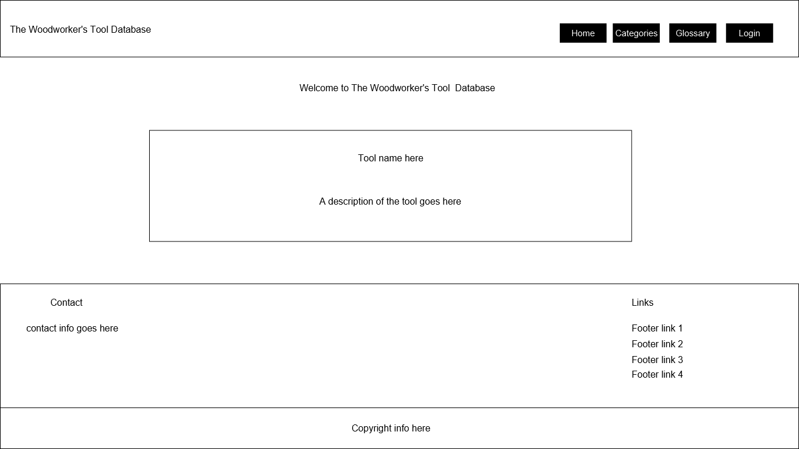

 

Mobile sidenav wireframe

 

Form example wireframe

# Database

## Database Technologies

The database for this project is powered by PostgreSQL, a powerful, open-source relational database management system (RDBMS). PostgreSQL was chosen due to its robustness, scalability, and ability to handle complex queries and relationships between tables. 

In the development environment, the project uses a local PostgreSQL database, and in the production environment, it is deployed on Heroku Postgres, ensuring seamless integration with the web application.

  

## Database Schema

The database for this project is designed to manage the relationships between users, woodworking tools, tool categories, and a user's toolbox (where users can save their favorite tools). The following describes the structure and relationships between the tables in the database.

### MainCategory Table

* Purpose: Stores the primary categories for tools.

* Columns:

  * id: Integer, primary key, auto-increment.
  * main_category_name: String (100), unique, not null. Stores the name of the main category (e.g., "Power Tools", "Hand Tools").

* Relationships:

  * One-to-many relationship with the SubCategory table. Each main category can have multiple subcategories.

### SubCategory Table

* Purpose: Stores subcategories within each main category.

* Columns:
  * id: Integer, primary key, auto-increment.
  * sub_category_name: String (100), unique, not null. Stores the name of the subcategory (e.g., "Saws", "Drills").
  * main_category_id: Foreign key, references id in the MainCategory table. This links each subcategory to its main category.

* Relationships:
  * Many-to-one relationship with the MainCategory table.
  * One-to-many relationship with the Tool table. Each subcategory can have multiple tools.

### Tool Table

* Purpose: Stores information about the individual woodworking tools.

* Columns:
  * id: Integer, primary key, auto-increment.
  * tool_name: String (50), unique, not null. Stores the name of the tool.
  * tool_description: Text, not null. Contains a detailed description of the tool.
  * tool_videos: JSON. Stores links to relevant videos for the tool (optional).
  * tool_links: JSON. Stores purchase links or external references for the tool (optional).
  * main_category_id: Foreign key, references id in the MainCategory table. This links the tool to its main category.
  * sub_category_id: Foreign key, references id in the SubCategory table. This links the tool to its subcategory.

* Relationships:

  * Many-to-one relationship with both MainCategory and SubCategory tables.
  * One-to-many relationship with the MyToolbox table. A tool can be saved in multiple user toolboxes.

### User Table

* Purpose: Stores user credentials for authentication and managing their toolbox.

* Columns:
  
  * id: Integer, primary key, auto-increment.
  * username: String (50), unique, not null. Stores the username for each user.
  * password_hash: String (128), not null. Stores the hashed password for user authentication.

* Methods:

  * generate_password_hash(password, method="pbkdf2:sha256"): Hashes and sets the password for a user.
  * check_password_hash(user.password_hash, password): Checks the provided password against the stored hash.

* Relationships:

  * One-to-many relationship with the MyToolbox table. Each user can save multiple tools in their toolbox.

### MyToolbox Table

* Purpose: Stores the tools that a user has saved to their toolbox.

* Columns:

  * id: Integer, primary key, auto-increment.
  * user_id: Foreign key, references id in the User table. Links the toolbox entry to a specific user.
  * tool_id: Foreign key, references id in the Tool table. Links the toolbox entry to a specific tool.

* Relationships:

  * Many-to-one relationship with both User and Tool tables. Each entry in this table links a user to a tool they have saved.

### Relationships Summary:

* MainCategory ↔ SubCategory: One-to-many relationship. Each main category has multiple subcategories.

* SubCategory ↔ Tool: One-to-many relationship. Each subcategory can contain multiple tools.

* User ↔ MyToolbox: One-to-many relationship. Each user can save multiple tools to their toolbox.

* Tool ↔ MyToolbox: One-to-many relationship. Each tool can appear in multiple toolboxes.

This structure ensures that users can explore tools based on their categories and save their favorite tools to their toolbox for easy reference.

### Benefits of the Schema:

* Scalability: The schema is designed to handle many users, tools, categories, and subcategories efficiently.

* Normalisation: The separation of categories, subcategories, and tools avoids data redundancy.

* Flexibility: The use of JSON columns allows easy addition of tool videos and purchase links without requiring additional tables.

 

### ERD 

The below Entity Relationship Diagram further illustrates the relationships between the tables.

 

# Features

## Favicon

The favicon is a very simple, shortened version of the app name in the same teal colour that proliferates the app.

 

## Navbar

When a visitor to the site first lands on the page, the only four items in the navbar are: 

* Home
* Categories
* Glossary
* Log In

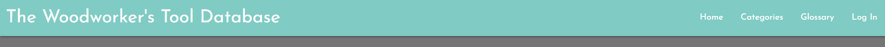

If a user logs in, the navbar and sidenav also display the features only available to registered users (the navbar and sidebar also clearly show the active page):

* My Toolbox
* Profile

 

## Footer

The footer also aids in site navigation with the same links as the navbar (which will change depending on whether the user is logged in or not).

Not logged in:

Logged in: 

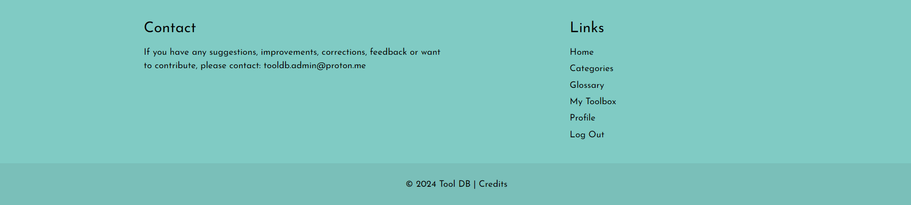

The footer links move to inline style on smaller screens and the footer also contains a contact email address for the site admin and also copyright information.

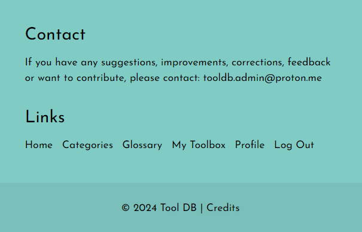
 

## Home Page

The Home Page for displays a random tool card that changes every ten seconds (implemented using some Javascript; the home page is the only page that has custom JS).

The card contains the tool name (which is a clickable link to the tool's page) and the tool description.

By clicking on the tool name link, the user is redirected to that tool's page which contains the name, description, product links and videos for that tool.

For users who log in, they have the additional option of adding the tool to their toolbox (more on that shortly):

 

## Categories

The categories page for contains Materialize's handy cards for each main category and when the user clicks "show subcategories", there is a card reveal that displays the subcategories for that main category. 

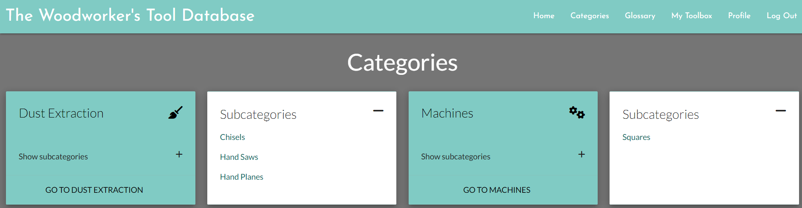

From here, users can navigate to the selected main category page:

 or each individual subcategory page:

 

 

## Tools

Each tool has a page containing the name and description, as well as product links and videos (if present):

 

 For users who are logged in, the option to add the tool to My Toolbox is also present under the product links:

 

  

### Glossary

The glossary page is an A-Z of all tools in the database (shown here in a rather bare state) and is the same for registered and non-registered users:

The tool name is a link to that tool's page and the description summary can be clicked to expand the tool description.

Similarly to the tool page, a logged in user has the option to add the tool to My Toolbox from the glossary page:

 

### Login

If the user clicks the login link from the navbar or footer, they are redirected to this page: 

On successful login, the user is redirected to the home page and a message is shown confirming that they are logged in:

Validation is built into the form, both through Materialize's built in validation class and also by specifying the pattern required:

If the user has not yet registered a profile, there is handy redirect underneath the form. Please note the cancel link under the login button: This link is on all form pages and will intuitively redirect the user to the most appropriate page.

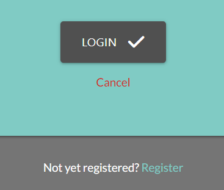

 

### Register

The register page / form requires the user to confirm their password and validation is built in to ensure they match:

 

# Logged In User Features

## My Toolbox

The My Toolbox is a unique feature that allows the user to store their favourite tools in a handy table:

The table includes a link to the tool's page (by clicking the name), product links to purchase the tool, links to the videos and the ability to remove the tool from the toolbox.

If the user attempts to add a tool that is already in the toolbox, the following message is displayed:

 

## Profile

The profile page allows the user to update their username and / or password as well as giving them the option of deleting the profile:

### Edit Username

From here the user can change their username via the below form:

 

### Edit Password

No prizes for guessing what the user can do here:

Once a user has updated either their username or password, a confirmation message is displayed and they are redirected back to the profile page (password update confirmation shown below):

 

### Delete Profile

This will delete the user's profile. Like all other delete functions, a modal is displayed asking the user to confirm deletion:

If they delete the profile, the below message is displayed and they are redirected to the default home page:

 

# Admin User

## Admin Navbar

The navbar for the admin user allows for easy adding of categories and tools. N.B. This functionality can be found in various places for the admin user but it seemed logical to include a direct route to these functions from the navbar (and the sidenav on smaller screens):

The admin navbar does not contain the logo as it was too cluttered, the home link is still available in the navbar and footer so no functionality is lost as a result of this (and one would hope that the admin user knows how to navigate the site).

## Admin Categories

The category view for the admin user is similar to the view for non-admin users but also incorporates the functionality to edit and delete the main category.

I wanted the admin user to be able to manage main categories and subcategories from this page. 

There is also an additional card that shows after all category cards that will redirect to the add main category page when clicked (it is quite obvious as it is a smaller car with a folder-plus icon):

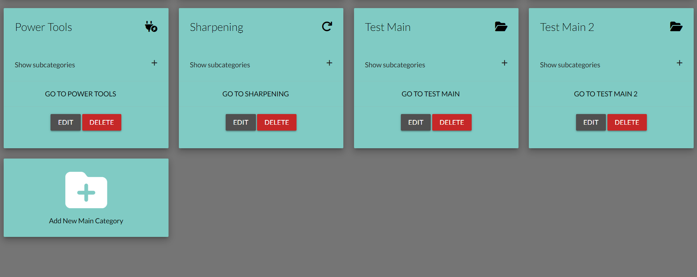

When expanded, the admin user has the ability to edit and delete subcategories associated with that main category:

 

### Add Main Category

Adding a main category can be accessed through the Add Category page:

Or by the clicking the add tool card on the categories page: 

Once on the add main category page, the form is very simple and clearly labelled.

All the user needs to do is input a category name and click "add category"

 

### Edit Main Category

This is pretty much identical to adding a main category with the exception of the input field being pre-populated with the current main category name.

 

### Delete Main Category

Deleting a main category is done via a modal confirming if the user wishes to delete the category or cancel.

And if the user chooses to delete the category, they are redirected to the categories page and a flash message is displayed.

 

### Add Subcategory

Adding a subcategory can be done via the add category page or by clicking the button on each expanded main category card:

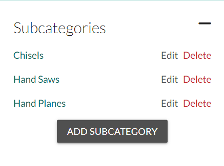

Adding a subcategory is also straightforward; the user is given two input fields to complete, 1 for the subcategory name and a dropdown to select a main category. 

 

### Edit Subcategory

The admin user can edit all aspects of the subcategory from this page:

Individual tools can be edited and deleted from this page. There is also a handy link to add a new tool. 

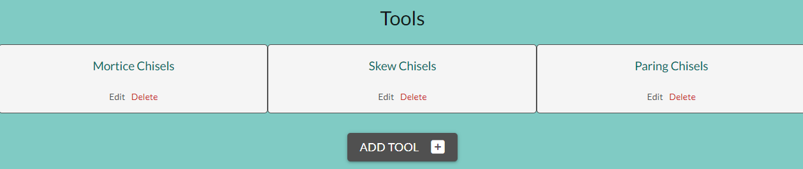

 

### Delete Subcategory

I only wanted this functionality in one place so I opted to place it only in the expanded main category card on the categories page:

 

### Add Tool

For session management and to ensure that the correct subcategories populate in step 3, the add tool function is split into 3 steps:

#### Step 1

The admin user needs to add a name and description and can also add product links and videos (though these are not required fields).

#### Step 2

Next, the admin user needs to select a main category from the dropdown.

#### Step 3

The final step involves them choosing a subcategory from the dropdown (only the subcategories in the main category selected in step 2 will populate)

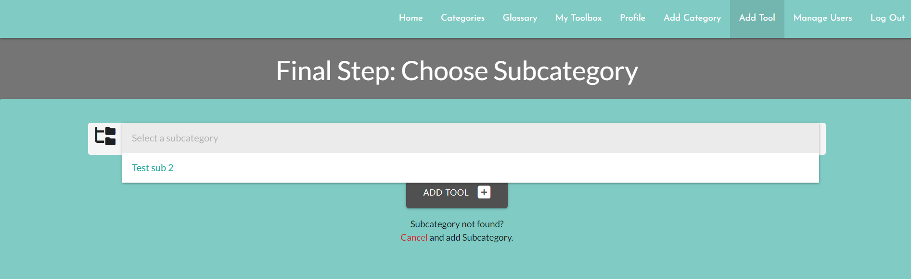

 

### Edit Tool

The form to edit a tool is in the same 3 step format as adding a tool, but the tool details are pre-populated in every step:

 

 

 

### Delete Tool

The delete tool button can only be found on the edit subcategory page:

When the admin user clicks the button, this modal appears:

And if the tool is deleted, it is confirmed and the admin user is redirected to the categories page:

 

### Manage Users

This is straightforward as I haven't yet incorporated the ability to reset the user's password, for now all the admin user can do is delete the user from the database:

Like deleting categories & tools, a modal is displayed confirming if the admin wishes to delete the user or not. If they delete the user, they are redirected back to the manage users page:

 

## Defense Defense Defense

As there is user data and database integrity at stake, I have ensured ensured that a user who isn't logged in has no access to any part of the site reserved for logged in or admin users.

I have specified that the role needs to be admin in order for a user to access that page. If a crafty user decides to manually enter the url for any of these pages (adding tools, categories, managing users etc.), this message is displayed:

There is a more polite message displayed if the user manually types a url where the stakes would not be so high if they were to gain access:

 

# Accessibility

## Accessibility Overview

The Woodworker's Tool Database is designed with accessibility in mind to ensure that all users, including those with disabilities, can navigate and use the features effectively. This section outlines my commitment to accessibility, the standards I follow, and how to use accessibility features within the app.

## Accessibility Standards

The Woodworker's Tool Database strives to adhere to the Web Content Accessibility Guidelines (WCAG) 2.1 at the AA level. Our goal is to provide a user-friendly experience for everyone, including people with visual, auditory, physical, and cognitive disabilities.

## Key Accessibility Features

* Semantic HTML:

  * I have used semantic HTML elements such as header, footer, main, nav, and section to provide clear structure and improve navigation for screen readers.

* Aria Roles and Labels:

  * Aria roles and labels are used to enhance screen reader support and provide additional context where necessary. For example:

    * a tags are labeled with aria-label where needed to clarify their purpose.
    * Role attributes are replaced with appropriate aria-labels to describe the function of elements, such as menu items and navigation links.

* Keyboard Navigation:

  * All interactive elements, including forms, buttons, and links, are accessible using keyboard navigation.

  * The site ensures that users can navigate through the application using the Tab key and other standard keyboard shortcuts.

* Form Accessibility:

  * Forms include labels associated with input fields using the for attribute to provide clear instructions and improve usability.

  * Error messages and validation cues are communicated clearly to users (more on this in the Error  Handling section above).

* Contrast and Readability:

  * High-contrast color schemes and readable fonts have been used throughout to ensure that text is easily distinguishable against the background.

* Responsive Design:

  * The application is designed to be responsive, ensuring that it remains accessible and usable across various devices and screen sizes.

* Focus Management:

  * Focus is managed to ensure that users are directed to relevant content and interactive elements appropriately. For example, focus is moved to modals or dynamic content when it is opened.

 

# Technologies

## Languages

* Python
* HTML
* JavaScript
* CSS

### Frameworks, Libraries and Programs

* Flask: A popular web application framework in Python, used to build the backend of the app.
* Flask-SQLAlchemy: An extension for Flask that adds support for SQLAlchemy (the Python SQL toolkit), which is used to interact with the PostgreSQL database.
* PostgreSQL: The relational database used to store information about tools, categories, users, and user toolboxes.
* Flask-Migrate: An extension that handles SQLAlchemy database migrations for Flask applications using Alembic.
* Werkzeug: A comprehensive WSGI web application library used here for security utilities like password hashing and checking (generate_password_hash and check_password_hash).
* SQLAlchemy: The ORM for Python that allows for efficient database queries and interactions with the PostgreSQL database.
* Jinja2: A templating engine for Python, integrated with Flask to render HTML templates dynamically.
* Random Module: A built-in Python module used to implement randomness in the application.
* Itertools Module: A built-in Python module used for efficient looping and grouping operations (groupby).
* Git: Version control used to manage the project codebase.
* GitHub: The repository hosting service used for version control and will be used for future collaboration.
* Heroku: The cloud platform where the app is deployed (more on deployment below).
* Lucidchart: Used to create the Entity Relationship Diagram (ERD) to visualise the database structure.
* Justinmid: USed to create the wireframes to help visualise this application. 

# Deployment and Development

## Deployment

This application was deployed to Heroku using the following steps:

1. Set up a Heroku account: Log in to Heroku or create a new account.

2. Create a new Heroku app through the Heroku Dashboard:

    * In the Heroku dashboard, click New > Create New App.
    * Choose a unique name for your app and select a region.

3. Add PostgreSQL:

    * In the app dashboard, go to the Resources tab.
    * In the "Add-ons" section, search for Heroku Postgres and select the Hobby Dev - Free plan.

4. Set up environment variables:

    * In the Settings tab, click Reveal Config Vars under Config Vars.
    * Add the following keys and values:
      * SECRET_KEY: Your secret key for the Flask app.
      * DEBUG: Set this to False for production.
      * DATABASE_URL: Automatically created when PostgreSQL is added.
      * PORT: Set this to 5000 (or leave as default).
      * IP: Set this to 0.0.0.0.

5. Connect your GitHub repository:

    * In the Deploy tab, scroll down to Deployment Method and select GitHub.
    * Search for your repository and connect it.
    * Enable Automatic Deploys (optional) or manually deploy the branch.

6. Run migrations:

    * In the More dropdown at the top-right corner of your app dashboard, select Run Console.
    * Type the following to apply database migrations:
      * flask db upgrade

7. Open the app: Once the deployment is successful, you can view your live app by clicking Open App at the top-right corner of the dashboard.

 

## Local Development

### Extensions required

* Flask
* Flask-SQLAlchemy
* Flask-Migrate
* psycopg2
* Werkzeug
* SQLAlchemy

### How to Fork

If you want to contribute to this project or create a personal version, you can fork the repository on GitHub (I will welcome any feedback, improvements or help in general really).

1. Navigate to the repository on GitHub.
2. Click the Fork button on the upper-right corner of the repository page.
3. The project will be copied to your GitHub account, and you can freely experiment with the code.

### How to Clone

To make a local copy of this repository:

1. In the GitHub repository, click on the Code button.
2. Copy the HTTPS URL provided.
3. Open your terminal and run the following command:

    * git clone https://github.com/your-username/your-repo-name.git

4. Navigate into the cloned directory and run the following command:

    * cd your-repo-name

You now have a local copy of the project and can follow the Local Development steps to get started.

 

# Testing

## Manual Testing

For detailed manual testing, see <a href="https://github.com/Cleg83/tool_db/blob/main/testing.md" target="_blank">testing.md</a>

## Automated Testing

### W3C

All pages passed the html validation check:

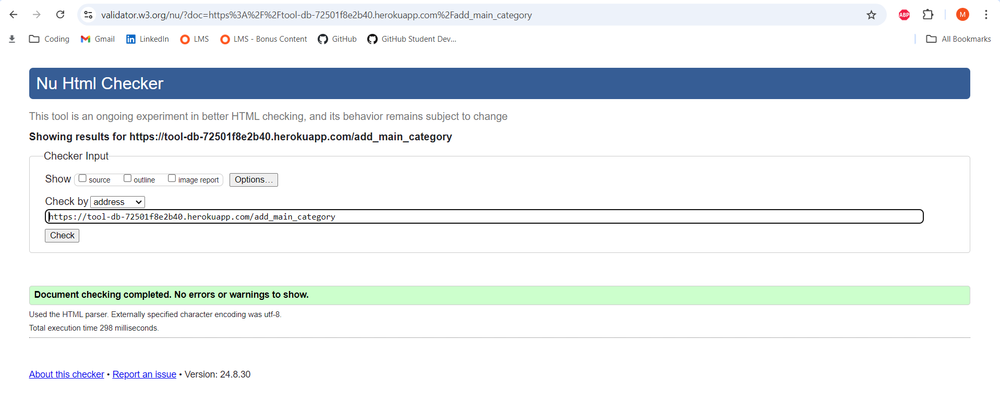

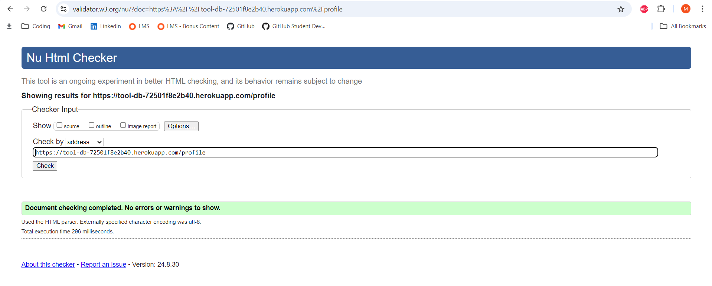

 

### Lighthouse 

Lighthouse scores for all of the many pages are all in the 90s. 

  * Anomaly - Best practices score of 79 on the selected tool page due to Google's third party cookie policy. This is the only page with embedded iframes. If a tool is added without video links then the scores are all in he 90s.

 

 

 

 

 

 

 

 

 

 

 

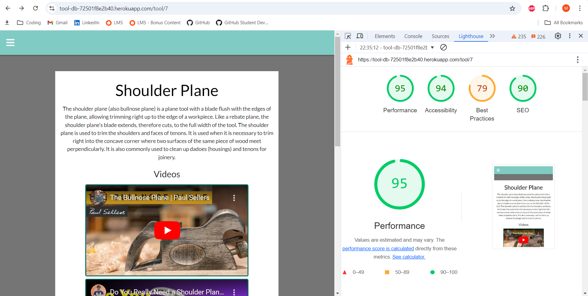

 

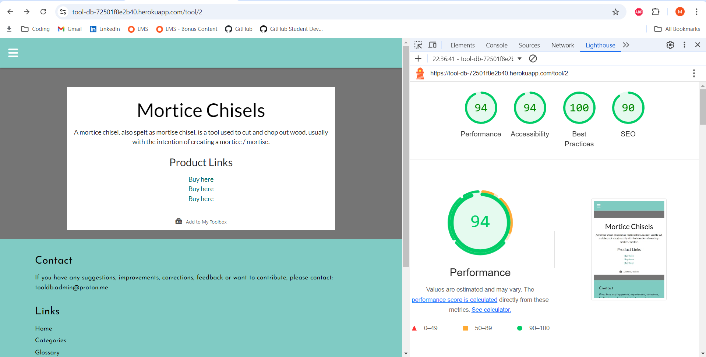
  

 

 

 

 

 

## JSHint

 

## Bugs

The only slight annoyance is that when a category tool card is expanded, the screen snaps to the top of the tool card. Not a major issue but one that will be fixed in future versions.

 

# Credits

Below is a list of resources I found enormously helpful when building this project:

  * <a href="https://www.w3schools.com/python/" target="_blank">W3Schools Python</a>
  * <a href="https://flask.palletsprojects.com/en/3.0.x/" target="_blank">Flask Docs</a>
  * <a href="https://www.youtube.com/watch?v=yBDHkveJUf4" target="_blank">This</a> lengthy flask tutorial has lots of useful advice.
  * <a href="https://freecodecamp.org" target="_blank">Free Code Camp</a> for lots of amazing free resources.
  * <a href="https://materializecss.com/" target="_blank">Materialize</a> invaluable for this site's design.
  * <a href="https://www.postgresql.org/docs/" target="_blank">Postgres docs</a>
  * Both the relational and non-relational walkthrough projects from the <a href="https://codeinstitute.net/" target="_blank">Code Institute</a> course I am currently studying on.