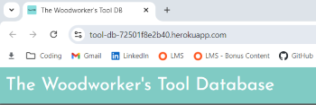
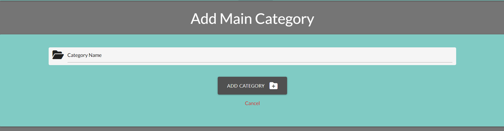
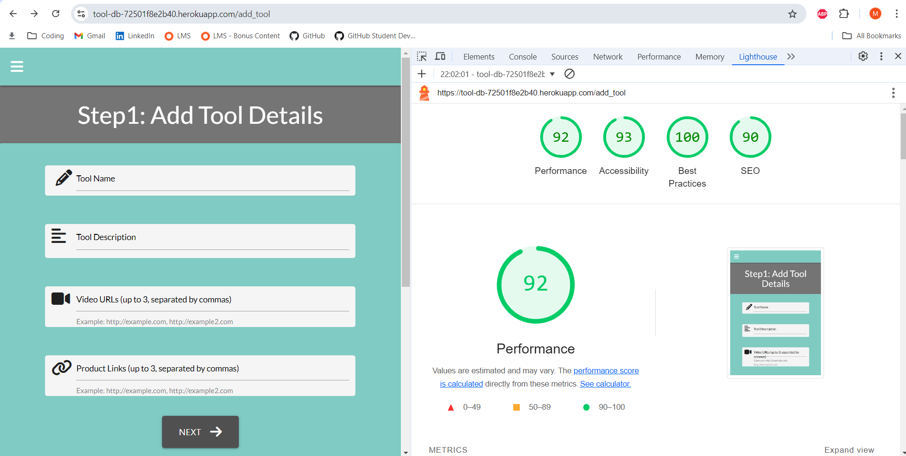
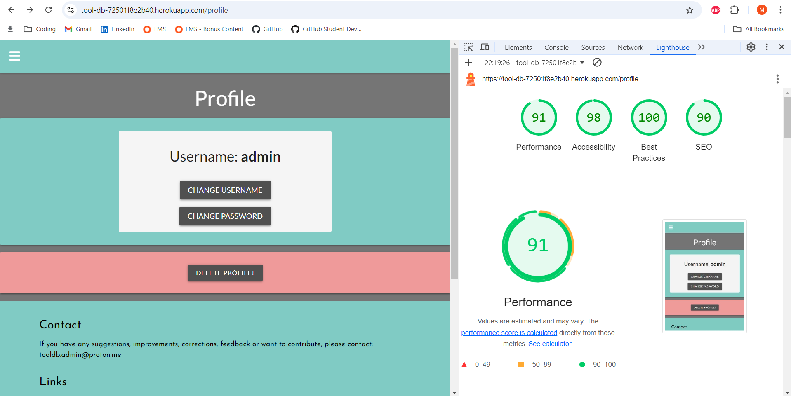
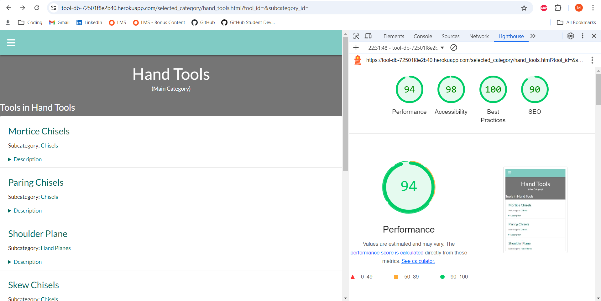

### The Woodworker's Tool Database is an incredible new resource for woodworkers featuring a comprehensive tool glossary the ability for registered users to save their favourite tools and videos!

Visit the deployed site [here](https://tool-db-72501f8e2b40.herokuapp.com/)

- - -

## CONTENTS

* [Rationale](#rationale)
  * [Project Introduction](#project-introduction)
  * [Motivation and Inspiration](#motivation-and-inspiration)
  * [Background Information](#background-information)
  * [Project Scope and Limitations](#project-scope-and-limitations)
    * [Scope](#scope)
    * [Limitations](#limitations)
  * [Problem Statement](#problem-statement)
  * [Proposed Solution](#proposed-solution)
  * [Benefits and Advantages](#benefits-and-advantages)
  * [Future Versions](#future-versions)
  * [Summary](#summary)

* [User Stories](#user-stories)
  * [New Users](#new-users)
  * [Logged In Users](#logged-in-users)
  * [Admin Users](#admin-users)

* [Design](#design)
  * [Colour Scheme](#colour-scheme)
  * [Typography](#typography)
  * [Wireframes](#wireframes)
    * [Desktop](#desktop)
    * [Tablet](#tablet)
    * [Mobile](#mobile)

* [Database](#database)
  * [Database Technologies](#database-technologies)
  * [Database Schema](#database-schema)
    * [MainCategory Table](#maincategory-table)
    * [Subcategory Table](#subcategory-table)
    * [Tool Table](#tool-table)
    * [User Table](#user-table)
    * [MyToolbox Table](#mytoolbox-table)
    * [ERD Diagram](#erd-diagram)

* [Features](#features)
  * [Favicon](#favicon)
  * [Navbar](#navbar)
  * [Footer](#footer)
  * [Home Page](#home-page)
  * [Categories](#categories)
  * [Tools](#tools)
  * [Glossary](#glossary) 
* [Registered User Features](#registered-user-features)
  * [My Toolbox](#my-toolbox)
  * [Profile](#profile)
    * [Edit Profile](#edit-profile)
    * [Delete Profile](#delete-profile)
  * [Admin Features](#admin-user)
    * [Admin Navbar](#admin-navbar)
    * [Admin Categories](#admin-categories)
    * [Add Main Category](#add-main-category)
    * [Edit Main Category](#edit-main-category)
    * [Delete Main Category](#delete-main-category)
    * [Add Sub Category](#add-sub-category)
    * [Edit Sub Category](#edit-sub-category)
    * [Delete Sub Category](#delete-sub-category)
    * [Add Tool](#add-tool)
    * [Edit Tool](#edit-tool)
    * [Delete Tool](#delete-tool)
    * [Delete User](#delete-user)

* [Accessibility](#accessibility)

* [Technologies](#technologies)
  * [Languages](#languages)
  * [Frameworks, Libraries and Programs](#frameworks-libraries-and-programs)

* [Deployment and Development](#deployment-and-development)
  * [Deployment](#deployment)
  * [Local Development](#local-development)
    * [Extensions required](#extensions-required)
    * [How to Fork](#how-to-fork)
    * [How to Clone](#how-to-clone)

* [Testing](#testing)
  * [Manual Testing](#manual-testing)
  * [Automated Testing](#automated-testing)
    * [W3C](#W3C)
    * [Lighthouse](#lighthouse)
    * [JS-Hint](#js-hint)
  * [Bugs](#Bugs)
  
* [Credits](#credits)

- - 

 

# Rationale

## Project Introduction

The Woodworking Tool Database is a comprehensive web application designed to serve woodworking enthusiasts and hobbyists by providing a centralised platform for discovering, learning about, and purchasing woodworking tools. 

The application features an extensive tool database, product videos, product links, and user-specific tool management, creating a one-stop resource for both novice and experienced woodworkers alike.

## Motivation and Inspiration

As a passionate hobbyist woodworker, the motivation behind this project stems from a desire to streamline the process of researching and purchasing woodworking tools. Previously, finding detailed information, instructional videos, and purchasing options for tools required navigating multiple sources, which was both time-consuming and inefficient. 

The inspiration for this project was to create a single, integrated resource that simplifies and enhances the tool acquisition process, thereby saving time and improving the overall woodworking experience.

## Background Information

To build anything out of wood, from the smallest bandsaw box to a monolithic cabinet; tools are essential. However, the process of selecting and purchasing the right tool often involves extensive research across multiple platforms. Users typically need to search for tool specifications, watch instructional videos, and find reliable purchase links; all of which are scattered across different websites. This fragmentation can lead to frustration and also creates a disjointed experience for users.

## Project Scope and Limitations

### Scope:

* Tool Database: A comprehensive collection of woodworking tools, each with detailed descriptions, instructional videos, and purchase links.

* User Management: Allows users to add tools to their personal toolbox and manage their profile / log in details.

* Integration: Seamlessly integrates video content and purchase options within the tool profiles.

### Limitations:

* Tool Information: The accuracy and comprehensiveness of tool data are dependent on available sources and user contributions.

* Video and Link Sources: Limited to available resources and may not cover all tools or have the latest product links.

* User Authentication: Currently supports basic authentication and may not include advanced user management features.

* Search functionality: Currently there is no way for a site user to search for tools. 

### Problem Statement

Woodworking enthusiasts face challenges in efficiently finding comprehensive information about tools, including their usage, instructional content, and purchase options. The existing fragmented resources often require users to navigate multiple websites, leading to a cumbersome and time-consuming experience. There is a need for a centralised platform that integrates tool information, instructional videos, and purchase links into a single, accessible resource.

## Proposed Solution

The Woodworking Tool Database addresses these challenges by providing an integrated web application where users can:

* Access detailed information about a wide range of woodworking tools.

* Watch instructional videos directly linked to each tool.

* Find and compare purchase options from various online retailers.

* Manage personal tool collections through a user-friendly interface.

* By consolidating these resources into one platform, the project enhances the user experience, simplifies the tool research process, and supports informed decision-making.

## Benefits and Advantages

* Centralized Resource: Combines tool information, videos, and purchase links into a single platform, saving time and effort.

* Enhanced Learning: Provides educational videos for each tool, helping users understand and utilize them more effectively.

* Convenience: Offers direct purchase links, allowing users to easily compare options and make purchases without navigating multiple websites.

* Personalization: Enables users to manage their own toolbox, keeping track of their favorite tools and preferences.

## Future Versions

Future versions of the project may include:

* Advanced User Management: Enhanced features for user profiles, tool recommendations, community interactions, password management. 

* Search and Navigation: Incorporate a search bar to search for tools by name.

* Tool Reviews and Ratings: User-generated reviews and ratings for tools to provide additional insights and feedback.

* Mobile Optimization: Improved user experience on mobile devices, including a dedicated mobile app.

* Expanded Database: Regular updates to the tool database with new tools, videos, and purchase links.

* Email integration.

## Summary

The Woodworking Tool Database is designed to simplify the process of discovering, learning about, and acquiring woodworking tools. By integrating detailed tool information, instructional videos, and purchase options into a single platform, the application addresses the fragmentation and inefficiencies in the current process. 

With its focus on user convenience and enhanced learning, the application aims to become a valuable resource for all woodworking enthusiasts.

 

# User Stories

## New Users

User Story 1: Explore Categories and Tools

* As a new user, I want to browse through various tool categories and view tools within each category.
* So that I can discover the types of tools available and their descriptions before deciding to register.

  * Acceptance Criteria:

    * The user can navigate to the "Categories" page from the main menu.
    * The user can view a list of categories and select one to see a list of tools within that category.
    * Each tool should have a name and a description.

 

User Story 2: Register for an Account

* As a new user, I want to be able to register for a new account.
* So that I can log in and access additional features like saving tools to a personal toolbox.

  * Acceptance Criteria:

    * The user can access the "Register" page from the login page or main menu.
    * The user can enter a username, password, and confirm the password.
    * The user receives a confirmation message upon successful registration and is redirected to the login page.

 

## Logged In Users

User Story 3: View and Manage My Toolbox

* As a logged-in user, I want to view the tools I have added to my toolbox and remove any tools I no longer want.
* So that I can keep my toolbox organized and relevant to my needs.

  * Acceptance Criteria:

    * The user can access the "My Toolbox" page from the main menu.
    * The user can see a list of tools they have added, including names, videos, and links.
    * The user can remove tools from their toolbox with a "Remove" button.

 

User Story 4: Update My Profile

* As a logged-in user, I want to update my username and password.
* So that I can keep my account information current and secure.

  * Acceptance Criteria:

    * The user can access the "Profile" page from the main menu.
    * The user can update their username by navigating to the "Change Username" section.
    * The user can update their password by navigating to the "Change Password" section.
    * The user receives a confirmation message upon successful updates.

 

## Admin Users

User Story 5: Manage Users

* As an admin user, I want to view a list of all users and delete users if necessary.
* So that I can manage user accounts and ensure the integrity of the user base.

  * Acceptance Criteria:

    * The admin can access the "Manage Users" page from the main menu.
    * The admin can see a list of all users, with options to delete each user.
    * The admin receives a confirmation prompt before deleting a user to prevent accidental deletions.

 

User Story 6: Add New Tool

* As an admin user, I want to add new tools to the database.
* So that I can keep the tool catalog up to date with the latest tools available.

  * Acceptance Criteria:

    * The admin can access the "Add Tool" page from the main menu.
    * The admin can fill out a form with tool details, including name, description, videos, and links.
    * The admin receives a confirmation message upon successful addition of a new tool and the tool  appears in the relevant categories.

 

User Story 7: Add New Category

* As an admin user, I want to add new categories to the tool database.
* So that I can organize tools into relevant and up-to-date categories.

  * Acceptance Criteria:

    * The admin can access the "Add Category" page from the main menu.
    * The admin can enter the name and description for the new category.
    * The admin receives a confirmation message upon successful addition of the new category.
    * The new category appears in the list of available categories on the relevant pages.

 

User Story 8: Edit Existing Tool

  * As an admin user, I want to edit details of an existing tool. 
  * So that I can correct information, update descriptions, or modify tool links and videos.

  * Acceptance Criteria:

    * The admin can access the "Edit Tool" page by selecting a tool from the list of tools.
    * The admin can update the tool’s name, description, videos, and links.
    * The admin receives a confirmation message upon successful update of the tool details.
    * The updated information is reflected in the tool's details on the relevant pages.

 

User Story 9: Edit Existing Category

* As an admin user, I want to edit details of an existing category.
* So that I can keep category names and descriptions current and accurate.

  * Acceptance Criteria:

    * The admin can access the "Edit Category" page by selecting a category from the list of categories.
    * The admin can update the category’s name and description.
    * The admin receives a confirmation message upon successful update of the category details.
    * The updated category information is reflected in the category listings and relevant pages.

# Design

## Color Scheme

I wanted an elegant teal for the navbar and footer. White text in the navbar, black text in the footer. A darker teal makes an appearance in headings and the home page tool names. 

Salmon pink was chosen as it complements the teal pleasantly and is less abrasive for flash messages than a harsh red. This was also used as the hover color for most buttons.

Other than that: Dark grey for certain borders and all form buttons.

 

## Typography

I opted to use a two sympathetic Google Fonts throughout the site.

[Josefin Sans](https://fonts.google.com/specimen/Josefin+Sans?query=josef) for the logo, navbar and footer text. 

[Lato](https://fonts.google.com/specimen/Lato?query=lato) for the site content:

 

# Database

## Database Technologies

The database for this project is powered by PostgreSQL, a powerful, open-source relational database management system (RDBMS). PostgreSQL was chosen due to its robustness, scalability, and ability to handle complex queries and relationships between tables. 

In the development environment, the project uses a local PostgreSQL database, and in the production environment, it is deployed on Heroku Postgres, ensuring seamless integration with the web application.

  

## Database Schema

The database for this project is designed to manage the relationships between users, woodworking tools, tool categories, and a user's toolbox (where users can save their favorite tools). The following describes the structure and relationships between the tables in the database.

### MainCategory Table

* Purpose: Stores the primary categories for tools.

* Columns:

  * id: Integer, primary key, auto-increment.
  * main_category_name: String (100), unique, not null. Stores the name of the main category (e.g., "Power Tools", "Hand Tools").

* Relationships:

  * One-to-many relationship with the SubCategory table. Each main category can have multiple subcategories.

### SubCategory Table

* Purpose: Stores subcategories within each main category.

* Columns:
  * id: Integer, primary key, auto-increment.
  * sub_category_name: String (100), unique, not null. Stores the name of the subcategory (e.g., "Saws", "Drills").
  * main_category_id: Foreign key, references id in the MainCategory table. This links each subcategory to its main category.

* Relationships:
  * Many-to-one relationship with the MainCategory table.
  * One-to-many relationship with the Tool table. Each subcategory can have multiple tools.

### Tool Table

* Purpose: Stores information about the individual woodworking tools.

* Columns:
  * id: Integer, primary key, auto-increment.
  * tool_name: String (50), unique, not null. Stores the name of the tool.
  * tool_description: Text, not null. Contains a detailed description of the tool.
  * tool_videos: JSON. Stores links to relevant videos for the tool (optional).
  * tool_links: JSON. Stores purchase links or external references for the tool (optional).
  * main_category_id: Foreign key, references id in the MainCategory table. This links the tool to its main category.
  * sub_category_id: Foreign key, references id in the SubCategory table. This links the tool to its subcategory.

* Relationships:

  * Many-to-one relationship with both MainCategory and SubCategory tables.
  * One-to-many relationship with the MyToolbox table. A tool can be saved in multiple user toolboxes.

### User Table

* Purpose: Stores user credentials for authentication and managing their toolbox.

* Columns:
  
  * id: Integer, primary key, auto-increment.
  * username: String (50), unique, not null. Stores the username for each user.
  * password_hash: String (128), not null. Stores the hashed password for user authentication.

* Methods:

  * set_password(password): Hashes and sets the password for a user.
  * check_password(password): Checks the provided password against the stored hash.

* Relationships:

  * One-to-many relationship with the MyToolbox table. Each user can save multiple tools in their toolbox.

### MyToolbox Table

* Purpose: Stores the tools that a user has saved to their toolbox.

* Columns:

  * id: Integer, primary key, auto-increment.
  * user_id: Foreign key, references id in the User table. Links the toolbox entry to a specific user.
  * tool_id: Foreign key, references id in the Tool table. Links the toolbox entry to a specific tool.

* Relationships:

  * Many-to-one relationship with both User and Tool tables. Each entry in this table links a user to a tool they have saved.

### Relationships Summary:

* MainCategory ↔ SubCategory: One-to-many relationship. Each main category has multiple subcategories.

* SubCategory ↔ Tool: One-to-many relationship. Each subcategory can contain multiple tools.

* User ↔ MyToolbox: One-to-many relationship. Each user can save multiple tools to their toolbox.

* Tool ↔ MyToolbox: One-to-many relationship. Each tool can appear in multiple toolboxes.

This structure ensures that users can explore tools based on their categories and save their favorite tools to their toolbox for easy reference.

### Benefits of the Schema:

* Scalability: The schema is designed to handle many users, tools, categories, and subcategories efficiently.

* Normalisation: The separation of categories, subcategories, and tools avoids data redundancy.

* Flexibility: The use of JSON columns allows easy addition of tool videos and purchase links without requiring additional tables.

 

### ERD Diagram

The below ERD diagram further illustrates the relationships between the tables.

 

# Features

## Favicon

The favicon is a very simple, shortened version of the app name in the same teal colour that proliferates the app.

 

## Navbar

When a visitor to the site first lands on the page, the only four items in the navbar are: 

* Home
* Categories
* Glossary
* Log In

If a user logs in, the navbar and sidenav also display the features only available to registered users:

* My Toolbox
* Profile

 

## Home Page

The Home Page for displays a random tool card that changes every ten seconds (implemented using some Javascript; the home page is the only page that has custom JS).

The card contains the tool name (which is a clickable link to the tool's page) and the tool description.

By clicking on the tool name link, the user is redirected to that tool's page which contains the name, description, product links and videos for that tool.

For users who log in, they have the additional option of adding the tool to their toolbox (more on that shortly):

 

## Categories

The categories page for contains Materialize's handy cards for each main category and when the user clicks "show subcategories", there is a card reveal that displays the subcategories for that main category. 

From here, users can navigate to the selected main category page:

 or each individual subcategory page:

 

 

## Tools

Each tool has a page containing the name and description, as well as product links and videos (if present):

 

### Glossary

The glossary page is an A-Z of all tools in the database (shown here in a rather bare state) and is the same for registered and non-registered users:

The tool name is a link to that tool's page and the description summary can be clicked to expand the tool description.

# Admin User

## Admin Navbar

The navbar for the admin user allows for easy adding of categories and tools. N.B. This functionality can be found in various places for the admin user but it seemed logical to include a direct route to these functions from the navbar (and the sidenav on smaller screens):

The admin navbar does not contain the logo as it was too cluttered, the home link is still available in the navbar and footer so no functionality is lost as a result of this (and one would hope that the admin user knows how to navigate the site).

## Admin Categories

The category view for the admin user is similar to the view for non-admin users but also incorporates the functionality to edit and delete the main category.

There is also an additional card that shows after all category cards that will redirect to the add main category page when clicked (it is quite obvious as it is a smaller car with a folder-plus icon):

When expanded, the admin user has the ability to edit and delete subcategories associated with that main category:

### Add Main Category

Adding a main category is pretty straightforward and only requires the user to type a category name. 

No other functionality or input fields were required as subcategories can be moved to different main categories when editing subcategories so this page is kept very simple indeed.

### Edit Main Category

This is pretty much identical to adding a main category with the exception of the input field being pre-populated with the current main category name.

### Delete Main Category

Deleting a main category is done via a modal confirming if the user wishes to delete the category or cancel.

And if the user chooses to delete the category, they are redirected to the categories page and a flash message is displayed.

### Add Subcategory

Adding a subcategory is also straightforward; the user is given two input fields to complete, 1 for the subcategory name and a dropdown to select a main category. 

# Testing

## Automated Testing

### Lighthouse 

Lighthouse scares for each of the many pages are all in the 90s

